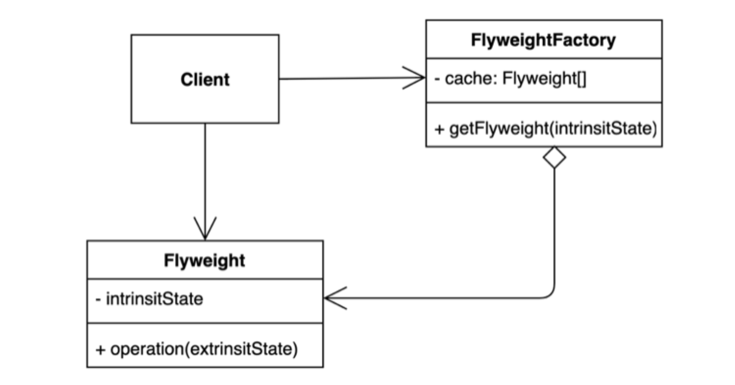

## 핵심 정리

### 장점

- 이름을 가질 수 있다. (동일한 시그니처의 생성자를 두개 가질 수 없다.)

```java
public static Order createForPrime(boolean prime, Product product) {
    Order order = new Order();
    order.prime = prime;
    order.product = product;
    return order;
}

public static Order createForUrgent(boolean urgent, Product product) {
    Order order = new Order();
    order.urgent = urgent;
    order.product = product;
    return order;
}
```

- 호출될 때마다 인스턴스를 새로 생성하지 않아도 된다. (Boolean.valueOf)

```java
public static final Boolean TRUE = new Boolean(true);
public static final Boolean FALSE = new Boolean(false);

public static Boolean valueOf(boolean b) {
    return (b ? TRUE : FALSE);
}

// main
Boolean.valueOf(false);
```

- 반환 타입의 하위 타입 객체를 반환할 수 있는 능력이 있다. (인터페이스 기반 프레임워크, 인터페이스에 정적 메소드)
- 입력 매개변수에 따라 매번 다른 클래스의 객체를 반환할 수 있다. (EnumSet)
- 정적 팩터리 메서드를 작성하는 시점에는 반환할 객체의 클래스가 존재하지 않아도 된다. (서비스 제공자 프레임워크)

```java
public interface HelloService {
    String hello();
}

public class ChineseHelloService implements HelloService {

    @Override
    public String hello() {
        return "Ni Hao";
    }
}

@Bean
public HelloService helloService() {
    return new ChineseHelloService();
}

// main
ServiceLoader<HelloService> loader = ServiceLoader.load(HelloService.class);
Optional<HelloService> helloServiceOptional = loader.findFirst();
helloServiceOptional.ifPresent(h -> {
    System.out.println(h.hello()); // Ni Hao
});
```

### 단점

- 상속을 하려면 public이나 protected 생성자가 필요하니 정적 팩터리 메서드만 제공하면 하위 클래스를 만들 수 없다.
- 정적 팩터리 메서드는 프로그래머가 찾기 어렵다.

## 완벽 공략 요약

- p9, 열거 타입은 인스턴트가 하나만 만들어짐을 보장한다.
- p9, 같은 객체가 자주 요청되는 상황이라면 플라이웨이트 패턴을 사용할 수 있다.
- p10, 자바 8부터는 인터페이스가 정적 메서드를 가질 수 없다는 제한이 풀렸기 때문에 인스턴스화 불가 동반 클래스를 둘 이유가 별로 없다.
- p11, 서비스 제공자 프레임워크를 만드는 근간이 된다.
- p12, 서비스 제공자 인터페이스가 없다면 각 구현체를 인스턴스로 만들 때 리플렉션을 사용해야 한다.
- p12, 브리지 패턴
- p12, 의존 객체 주입 프레임워크

## 완벽 공략 1. 열거 타입

### Enumeration

- 상수 목록을 담을 수 있는 데이터 타입.
- 특정한 변수가 가질 수 있는 값을 제한할 수 있다. 타입-세이프티 (Type-Safety)를 보장할 수 있다. 싱글톤 패턴을 구현할 때 사용하기도 한다.
- 질문1) 특정 enum 타입이 가질 수 있는 모든 값을 순회하며 출력하라.

```java
Arrays.stream(OrderStatus.values())
      .forEach(orderStatus1 -> System.out.println("orderStatus1 = " + orderStatus1));
```

- 질문2) enum은 자바의 클래스처럼 생성자, 메소드, 필드를 가질 수 있는가?

```java
public enum OrderStatus {
    PREPARING(0), SHIPPED(1), DELIVERING(2), DELIVERED(3);

    private int number;

    OrderStatus(int number) {
        this.number = number;
    }
}
```

- 질문3) enum의 값은 == 연산자로 동일성을 비교할 수 있는가?

```java
Order order = new Order();
if (order.orderStatus == OrderStatus.DELIVERED) { // enum
    System.out.println("order = " + order);
}
```

- 질문4) enum을 key로 사용하는 Map을 정의하세요.

```java
EnumMap<OrderStatus, String> enumMap = new EnumMap(OrderStatus.class);
enumMap.put(OrderStatus.PREPARING, "PRE");
enumMap.put(OrderStatus.DELIVERING, "DEL");
enumMap.put(OrderStatus.SHIPPED, "SHIPP");
enumMap.put(OrderStatus.DELIVERED, "DELIVERED");

for (Map.Entry<OrderStatus, String> orderStatusStringEntry : enumMap.entrySet()) {
    System.out.println("orderStatusStringEntry.getKey() = " + orderStatusStringEntry.getKey());
    System.out.println("orderStatusStringEntry.getValue() = " + orderStatusStringEntry.getValue());
}
```

- 질문5) enum을 담고 있는 Set을 만들어 보세요.

```java
EnumSet<OrderStatus> allOfOrderStatuses = EnumSet.allOf(OrderStatus.class);
System.out.println("allOfOrderStatuses = " + allOfOrderStatuses);

EnumSet<OrderStatus> noneOfOrderStatuses = EnumSet.noneOf(OrderStatus.class);
System.out.println("noneOfOrderStatuses = " + noneOfOrderStatuses);

EnumSet<OrderStatus> ofOrderStatuses = EnumSet.of(OrderStatus.SHIPPED, OrderStatus.PREPARING);
System.out.println("ofOrderStatuses = " + ofOrderStatuses);
```

### HashMap vs EnumMap

- HashMap은 key를 bucket에 저장하고 각 bucket이 linked list를 참조 하고 있음. (LinkedList에는 hash(key)가 같은 element가 들어감)
- EnumMap의 경우 key로 사용할 값이 제한되어 있으므로, 그 갯수만큼 길이를 가진 array를 선언함. 해당 index에 값을 넣으면 됨.

### HashSet vs EnumSet

- HashSet은 HashMap과 같은데 map의 value가 있다 없다를 표현하는 지시자 같은 값이 들어감.
- EnumSet은 값이 있다 없다만 표시하면 되니까 EnumMap처럼 array로 구현하지 않고 10101011 같은 bit vector로 구현이 가능.

## 완벽 공략 2. 플라이웨이트 패턴

### Flyweight (가벼운 체급)

- 객체를 가볍게 만들어 메모리 사용을 줄이는 패턴.
- 자주 변하는 속성(또는 외적인 속성, extrinsit)과 변하지 않는 속성(또는 내적인 속성, intrinsit)을 분리하고 재사용하여 메모리 사용을 줄일 수 있다.



## 완벽 공략 3. 인터페이스에 정적 메소드

### 자바 8과 9에서 주요 인터페이스의 변화

기본 메소드(default method)와 정적 메소드를 가질 수 있다.

- 기본 메소드
  - 인터페이스에서 메소드 선언 뿐 아니라, 기본적인 구현체까지 제공할 수 있다.
  - 기존의 인터페이스를 구현하는 클래스에 새로운 기능을 추가할 수 있다.
- 정적 메소드
  - 자바 9부터 private static 메소드도 가질 수 있다.
  - 단, private 필드는 아직도 선언할 수 없다.
- 질문1) 내림차순으로 정렬하는 `Comparator`를 만들고 `List<Integer>`를 정렬하라.

```java
List<Integer> numbers = new ArrayList();
numbers.add(10);
numbers.add(100);
numbers.add(20);
numbers.add(44);
numbers.add(3);

Comparator<Integer> desc = (o1, o2) -> o2 - o1;
numbers.sort(desc);
```

- 질문2) 질문1에서 만든 `Comparator`를 사용해서 오름차순으로 정렬하라.

```java
numbers.sort(desc.reversed());
```

## 완벽 공략 4. 서비스 제공자 프레임워크

### 확장 가능한 애플리케이션을 만드는 방법

- 주요 구성 요소
  - 서비스 제공자 인터페이스 (SPI)와 서비스 제공자 (서비스 구현체)
  - 서비스 제공자 등록 API (서비스 인터페이스의 구현체를 등록하는 방법)
  - 서비스 접근 API (서비스의 클라이언트가 서비스 인터페이스의 인스턴스를 가져올 때 사용하는 API)
- 다양한 변형
  - 브릿지 패턴
  - 의존 객체 주입 프레임워크
  - java.util.ServiceLoader
    - [https://docs.oracle.com/javase/tutorial/sound/SPI-intro.html](https://docs.oracle.com/javase/tutorial/sound/SPI-intro.html)
    - [https://docs.oracle.com/javase/tutorial/ext/basics/spi.html](https://docs.oracle.com/javase/tutorial/ext/basics/spi.html)

## 완벽 공략 5. 리플렉션

### reflection

- 클래스로더를 통해 읽어온 클래스 정보(거울에 반사된 정보)를 사용하는 기술
- 리플렉션을 사용해 클래스를 읽어오거나, 인스턴스를 만들거나, 메소드를 실행하거나, 필드의 값을 가져오거나 변경하는 것이 가능하다.
- 언제 사용할까?
  - 특정 애노테이션이 붙어있는 필드 또는 메소드 읽어오기 (JUnit, Spring)
  - 특정 이름 패턴에 해당하는 메소드 목록 가져와 호출하기 (getter, setter)
- [https://docs.oracle.com/javase/tutorial/reflect/](https://docs.oracle.com/javase/tutorial/reflect/)

```toc
```
