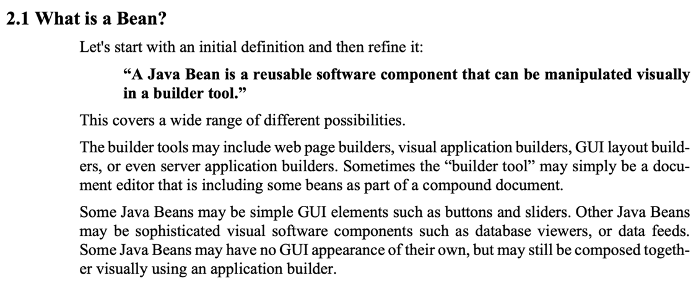
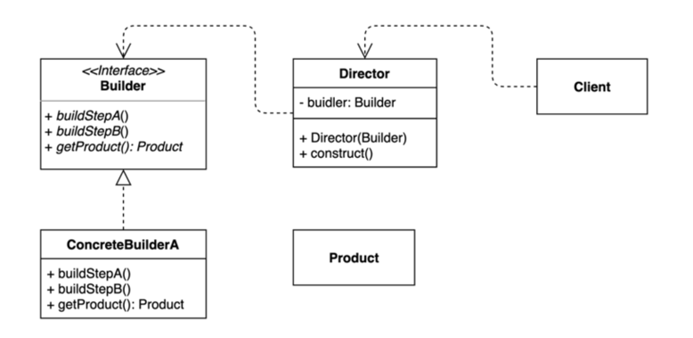

## 정적 팩토리와 생성자에 선택적 매개변수가 많을 때

### 대안1: 점층적 생성자 패턴 또는 생성자 체이닝

- 매개변수가 늘어나면 클라이언트 코드를 작성하거나 읽기 어렵다.

```java
// 코드 2-1 점층적 생성자 패턴 - 확장하기 어렵다! (14~15쪽)
public class NutritionFacts {
    private final int servingSize;  // (mL, 1회 제공량)     필수
    private final int servings;     // (회, 총 n회 제공량)   필수
    private final int calories;     // (1회 제공량당)       선택
    private final int fat;          // (g/1회 제공량)       선택
    private final int sodium;       // (mg/1회 제공량)      선택
    private final int carbohydrate; // (g/1회 제공량)       선택

    public NutritionFacts(int servingSize, int servings) {
        this(servingSize, servings, 0);
    }

    public NutritionFacts(int servingSize, int servings, int calories) {
        this(servingSize, servings, calories, 0);
    }

    public NutritionFacts(int servingSize, int servings, int calories, int fat) {
        this(servingSize, servings, calories, fat, 0);
    }

    public NutritionFacts(int servingSize, int servings, int calories, int fat, int sodium) {
        this(servingSize, servings, calories, fat, sodium, 0);
    }

    public NutritionFacts(int servingSize, int servings, int calories, int fat, int sodium, int carbohydrate) {
        this.servingSize = servingSize;
        this.servings = servings;
        this.calories = calories;
        this.fat = fat;
        this.sodium = sodium;
        this.carbohydrate = carbohydrate;
    }

    public static void main(String[] args) {
        NutritionFacts cocaCola = new NutritionFacts(10, 10);
    }
}
```

### 대안2: 자바빈즈 패턴

- 완전한 객체를 만들려면 메서드를 여러번 호출해야 한다. (일관성이 무너진 상태가 될 수도 있다.)
- 클래스를 불변으로 만들 수 없다.

```java
// 코드 2-2 자바빈즈 패턴 - 일관성이 깨지고, 불변으로 만들 수 없다. (16쪽)
public class NutritionFacts {
    // 필드 (기본값이 있다면) 기본값으로 초기화된다.
    private int servingSize = -1; // 필수; 기본값 없음
    private int servings = -1; // 필수; 기본값 없음
    private int calories = 0;
    private int fat = 0;
    private int sodium = 0;
    private int carbohydrate = 0;
    private boolean healthy;

    public NutritionFacts() {
    }

    public void setServingSize(int servingSize) {
        this.servingSize = servingSize;
    }

    public void setServings(int servings) {
        this.servings = servings;
    }

    public void setCalories(int calories) {
        this.calories = calories;
    }

    public void setFat(int fat) {
        this.fat = fat;
    }

    public void setSodium(int sodium) {
        this.sodium = sodium;
    }

    public void setCarbohydrate(int carbohydrate) {
        this.carbohydrate = carbohydrate;
    }

    public void setHealthy(boolean healthy) {
        this.healthy = healthy;
    }

    public static void main(String[] args) {
        NutritionFacts cocaCola = new NutritionFacts();
        cocaCola.setServingSize(240);
        cocaCola.setServings(8);
        cocaCola.setCalories(100);
        cocaCola.setSodium(35);
        cocaCola.setCarbohydrate(27);
    }
}
```

### 권장하는 방법: 빌더 패턴1

```java
// 코드 2-3 빌더 패턴 - 점층적 생성자 패턴과 자바빈즈 패턴의 장점만 취했다. (17~18쪽)
public class NutritionFacts {
    private final int servingSize;
    private final int servings;
    private final int calories;
    private final int fat;
    private final int sodium;
    private final int carbohydrate;

    public static void main(String[] args) {
        NutritionFacts cocaCola = new Builder(240, 8)
                .calories(100)
                .sodium(35)
                .carbohydrate(27).build();
    }

    public static class Builder {
        // 필수 매개변수
        private final int servingSize;
        private final int servings;

        // 선택 매개변수 - 기본값으로 초기화한다.
        private int calories = 0;
        private int fat = 0;
        private int sodium = 0;
        private int carbohydrate = 0;

        public Builder(int servingSize, int servings) {
            this.servingSize = servingSize;
            this.servings = servings;
        }

        public Builder calories(int val) {
            calories = val;
            return this;
        }

        public Builder fat(int val) {
            fat = val;
            return this;
        }

        public Builder sodium(int val) {
            sodium = val;
            return this;
        }

        public Builder carbohydrate(int val) {
            carbohydrate = val;
            return this;
        }

        public NutritionFacts build() {
            return new NutritionFacts(this);
        }
    }

    private NutritionFacts(Builder builder) {
        servingSize = builder.servingSize;
        servings = builder.servings;
        calories = builder.calories;
        fat = builder.fat;
        sodium = builder.sodium;
        carbohydrate = builder.carbohydrate;
    }
}
```

- 점층적 생성자보다 클라이언트 코드를 읽고 쓰기가 훨씬 간결하고, 자바빈즈 보다 훨씬 안전하다.
- 플루언트 API 또는 메서드 체이닝을 한다. (this를 리턴하기 때문)

### 권장하는 방법: 빌더 패턴2 (계층적 클래스)

```java
// 코드 2-4 계층적으로 설계된 클래스와 잘 어울리는 빌더 패턴 (19쪽)
// 참고: 여기서 사용한 '시뮬레이트한 셀프 타입(simulated self-type)' 관용구는 빌더뿐 아니라 임의의 유동적인 계층구조를 허용한다.
public abstract class Pizza {
    public enum Topping {HAM, MUSHROOM, ONION, PEPPER, SAUSAGE}

    final Set<Topping> toppings;

    abstract static class Builder<T extends Builder<T>> {
        EnumSet<Topping> toppings = EnumSet.noneOf(Topping.class);

        public T addTopping(Topping topping) {
            toppings.add(Objects.requireNonNull(topping));
            return self();
        }

        abstract Pizza build();

        // 하위 클래스는 이 메서드를 재정의(overriding)하여 "this"를 반환하도록 해야 한다.
        protected abstract T self();
    }

    Pizza(Builder<?> builder) {
        toppings = builder.toppings.clone(); // 아이템 50 참조
    }
}

// 코드 2-6 칼초네 피자 - 계층적 빌더를 활용한 하위 클래스 (20~21쪽)
public class Calzone extends Pizza {
    private final boolean sauceInside;

    public static class Builder extends Pizza.Builder<Builder> {
        private boolean sauceInside = false; // 기본값

        public Builder sauceInside() {
            sauceInside = true;
            return this;
        }

        @Override
        public Calzone build() {
            return new Calzone(this);
        }

        @Override
        protected Builder self() {
            return this;
        }
    }

    private Calzone(Builder builder) {
        super(builder);
        sauceInside = builder.sauceInside;
    }

    @Override
    public String toString() {
        return String.format("%s로 토핑한 칼초네 피자 (소스는 %s에)",
                toppings, sauceInside ? "안" : "바깥");
    }
}

// 계층적 빌더 사용 (21쪽)
public class PizzaTest {
    public static void main(String[] args) {
        Calzone calzone = new Calzone.Builder()
                .addTopping(HAM)
                .sauceInside()
                .build();

        System.out.println(calzone);
    }
}
```

- 계층적으로 설계된 클래스와 함께 사용하기 좋다.

## 빌더패턴과 Lombok의 @Builder와 차이점
`@Builder` <- 롬복의 빌더로 코드의 양을 줄일 순 있지만, 두가지 차이점이 존재한다.  

1. 모든 매개변수를 받는 생성자가 없다면 자동 생성되기 때문에 `private` 접근제어자로 생성해야함
3. 필수 값을 설정할 수 있는 방법이 없음

```java
// 코드 2-3 빌더 패턴 - 점층적 생성자 패턴과 자바빈즈 패턴의 장점만 취했다. (17~18쪽)
@Builder
@AllArgsConstructor(access = AccessLevel.PRIVATE)
public class NutritionFactsLombok {
    private final int servingSize;
    private final int servings;
    private final int calories;
    private final int fat;
    private final int sodium;
    private final int carbohydrate;

    public static void main(String[] args) {
        NutritionFactsLombok cocaCola = NutritionFactsLombok.builder() // 롬복 빌더는 필수 매개변수 설정을 할 수 없다.
                .servingSize(240)
                .servings(8)
                .calories(100)
                .sodium(35)
                .carbohydrate(27)
                .build();
    }
}
```

## 완벽 공략 요약

p15, 자바빈즈, 게터, 세터  
p17, 객체 얼리기 (freezing)  
p17, 빌더 패턴  
p19, IllegalArgumentException  
P21, 가변인수 (varargs) 매개변수를 여러 개 사용할 수 있다.  

## 완벽 공략 6. 자바빈(JavaBean)이란?

재사용 가능한 소프트웨어 컴포넌트 (주로 GUI에서)



- java.beans 패키지 안에 있는 모든 것
- 그 중에서도 자바빈이 지켜야 할 규약
- args 없는 기본 생성자 getter 와 setter 메소드 이름 규약 Serializable 인터페이스 구현
  - 대표적으로 @RequestBody에서 사용되는 ObjectMapper가 기본생성자로 객체를 생성하고 자바빈 규약에 맞게 설정된 getter를 찾아 필드를 바인딩한다.
- 하지만 실제로 오늘날 자바빈 스팩 중에서도 기본생성자와 getter, setter가 주로 쓰는 이유는?
  - JPA나 스프링과 같은 여러 프레임워크에서 리플렉션을 통해 특정 객체의 값을 조회하거나 설정하기 때문입니다.

## 완벽 공략 7. 객체 얼리기 (freezing)

임의의 객체를 불변 객체로 만들어주는 기능 (javascript)

- Object.freeze()에 전달한 객체는 그뒤로 변경될 수 없다.
  - 새 프로퍼티를 추가하지 못함
  - 기존 프로퍼티를 제거하지 못함
  - 기존 프로퍼티 값을 변경하지 못함
  - 프로토타입을 변경하지 못함
- strict 모드에서만 동작함
- 비슷한 류의 펑션으로 Object.seal()과 Object.preverntExtensions()가 있다.
- java 진영에서 구현하려면 freeze 상태를 구분할 수 있는 필드값을 놓고 다른 필드를 수정할 때마다 freeze 상태를 체크하는 로직으로 구현
  - 하지만 거의 쓰지 않음
  - 그 이유는 가변객체에서 freezing을 하고 불변객체를 만드는 것인데, 언제 오퍼레이션이 됐는지 확인하기 어렵고 매우 이해하기 힘든 구조가될 가능성 높음

## 완벽 공략 8. 빌더 패턴

동일한 프로세스를 거쳐 다양한 구성의 인스턴스를 만드는 방법.

- 복잡한 객체를 만드는 프로세스를 독립적으로 분리할 수 있다.



- 빌더 인터페이스

```java
public interface TourPlanBuilder {
    TourPlanBuilder nightsAndDays(int nights, int days);

    TourPlanBuilder title(String title);

    TourPlanBuilder startDate(LocalDate localDate);

    TourPlanBuilder whereToStay(String whereToStay);

    TourPlanBuilder addPlan(int day, String plan);

    TourPlan getPlan();
}
```

- 빌더 구현체

```java
public class DefaultTourBuilder implements TourPlanBuilder {
    private String title;
    private int nights;
    private int days;
    private LocalDate startDate;
    private String whereToStay;
    private List<DetailPlan> plans;

    @Override
    public TourPlanBuilder nightsAndDays(int nights, int days) {
        this.nights = nights;
        this.days = days;
        return this;
    }

    @Override
    public TourPlanBuilder title(String title) {
        this.title = title;
        return this;
    }

    @Override
    public TourPlanBuilder startDate(LocalDate startDate) {
        this.startDate = startDate;
        return this;
    }

    @Override
    public TourPlanBuilder whereToStay(String whereToStay) {
        this.whereToStay = whereToStay;
        return this;
    }

    @Override
    public TourPlanBuilder addPlan(int day, String plan) {
        if (this.plans == null) {
            this.plans = new ArrayList<>();
        }

        this.plans.add(new DetailPlan(day, plan));
        return this;
    }

    @Override
    public TourPlan getPlan() {
        return new TourPlan(title, nights, days, startDate, whereToStay, plans);
    }
}
```

- 빌더 디렉터

```java
public class TourDirector {
    private TourPlanBuilder tourPlanBuilder;

    public TourDirector(TourPlanBuilder tourPlanBuilder) {
        this.tourPlanBuilder = tourPlanBuilder;
    }

    public TourPlan cancunTrip() {
        return tourPlanBuilder.title("칸쿤 여행")
                .nightsAndDays(2, 3)
                .startDate(LocalDate.of(2020, 12, 9))
                .whereToStay("리조트")
                .addPlan(0, "체크인하고 짐 풀기")
                .addPlan(0, "저녁 식사")
                .getPlan();
    }

    public TourPlan longBeachTrip() {
        return tourPlanBuilder.title("롱비치")
                .startDate(LocalDate.of(2021, 7, 15))
                .getPlan();
    }
}
```

- 디렉터 사용 코드

```java
public class App {
    public static void main(String[] args) {
        TourDirector director = new TourDirector(new DefaultTourBuilder());
        TourPlan cancunPlan = director.cancunTrip();
        TourPlan longBeachPlan = director.longBeachTrip();
    }
}
```

## 완벽 공략 9. IllegalArgumentException

잘못된 인자를 넘겨 받았을 때 사용할 수 있는 기본 런타임 예외

```java
if (deliveryDate.isBefore(LocalDate.now())) {  
    throw new IllegalArgumentException("deliveryDate can't be earlier than " + LocalDate.now());  
}
```

- 질문1) checked exception과 unchecked exception의 차이?
  - 클라이언트에게 꼭 확인해서 처리하라는 메세지를 남기는 것이 checked
  - 런타임 중 날 수 있는 익셉션이 unchecked
    - 매우 많은 예외가 존재하기 때문에 모두 다 체크할 수 없음
- 질문2) 간혹 메소드 선언부에 unchecked exception을 선언하는 이유는?
  - 런타임 중 나는 것 중 꼭 확인했으면 하는 것들을 throws 한다.
- 질문3) checked exception은 왜 사용할까?  
  - 이 메서드를 호출할 때 꼭 check 하라는 의미

## 완벽 공략 10. 가변인수

여러 인자를 받을 수 있는 가변적인 argument (Var+args)

```java
public void printNumbers(int... numbers) {  
    System.out.println(numbers.getClass().getCanonicalName());  
    System.out.println(numbers.getClass().getComponentType());  
    Arrays.stream(numbers).forEach(System.out::println);  
}  
  
public static void main(String[] args) {  
    VarargsSamples samples = new VarargsSamples();  
    samples.printNumbers(1, 20, 20, 39, 59);  
}
```

- 가변인수는 메소드에 오직 하나만 선언할 수 있다.
- 가변인수는 메소드의 가장 마지막 매개변수가 되어야 한다.
- 빌더패턴의 메소드 체이닝 방식으로 가변인수를 여러개 받을 수 있다.

```java
public SampleBuilder strings(String... strings){
    this.strings = strings;
    return this;
}

public SampleBuilder numbers(int... numbers){
    this.numbers = numbers;
    return this;
}

// main
public static void main(String[] args) {  
    new SampleBuilder()
        .strings("1","2","3")
        .numbers(1,2,3,4,5,6)
        .build();
}
```

```toc
```
